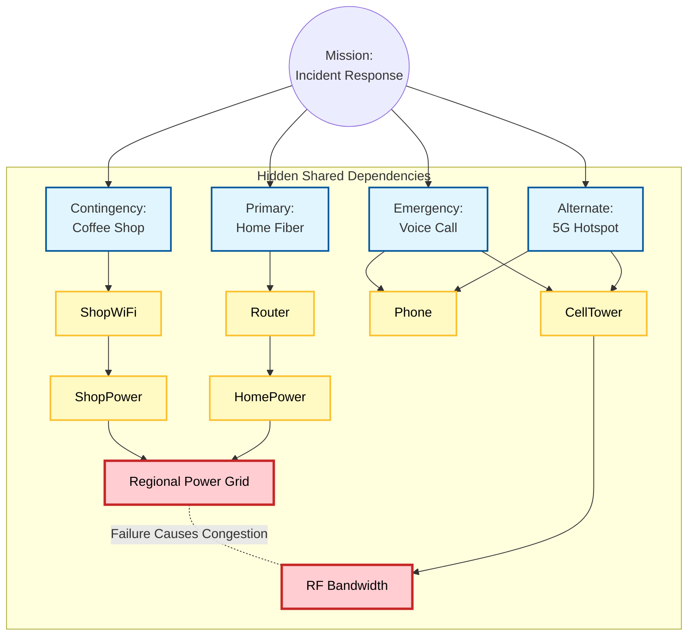

---  
title: "PACE Planning: Why Your \"Solid\" Backup Plan Is Probably Fragile"
date: 2026-01-09T12:00:00Z
slug: "pace-planning-fragile-backups"
categories: ["software", "resilience"]
years: ["2026"]
draft: true
math: true
---  

# PACE Planning: Why Your "Solid" Backup Plan Is Probably Fragile

We tell ourselves that we are prepared. We have backups. We have redundancies. In software engineering, we pride ourselves on avoiding Single Points of Failure (SPOF).

But often, when chaos actually strikes—a server outage, a natural disaster, or just a really bad Monday—we find that our backup plans were little more than lists of things we *hoped* would work.

There is a framework for curing this optimism bias. It’s called **PACE planning**.

It originated in the military (specifically for communication plans in Special Operations), but I’ve found it to be an incredibly potent tool for engineering resilience and personal peace of mind. It transforms "trying to figure it out on the fly" into a structured algorithm for continuity.

However, as we will see, simply writing a PACE plan down on a napkin isn't enough. If you don't understand your dependencies, even a four-layer backup plan can collapse in seconds.

## What is PACE?

PACE is an acronym that establishes an order of precedence for the methods used to achieve a critical goal (the "mission"). It forces you to define four distinct ways to get the job done:

*   **P - Primary:** The preferred method. It is the most efficient, effective, and habitual way you execute the task.
*   **A - Alternate:** The iconic "Plan B." It should be nearly as effective as the Primary, often running in parallel or available with minimal friction.
*   **C - Contingency:** "Plan C." This is where things get annoying. Ideally, the Contingency method is reliable but less convenient, slower, or more resource-intensive.
*   **E - Emergency:** The last resort. "Plan D." This is usually a break-glass method. It will likely be slow, expensive, or provide only minimum viability, but it prevents total mission failure.

There is a crucial nuance in the formal definition of PACE that often gets ignored: the four methods must be **"independent enough that failure of one does not break the others."**

That logical condition—*independent enough*—is the hardest part to get right.

## The Happy Path: A Simple Example

To see how this works, let’s apply it to a low-stakes, critical daily mission: **Getting Morning Coffee.**

*   **Primary:** The Espresso Machine. (Fast, delicious, routine).
*   **Alternate:** The French Press. (Slower cleanup, requires a separate kettle, but good quality).
*   **Contingency:** Instant Coffee. (Tastes worse, requires boiling water, very fast).
*   **Emergency:** A canned energy drink from the fridge. (Cold, different chemical profile, but delivers the caffeine payload).

**Why is this a good plan?**
Because the dependencies are physically distinct.
If the complex electronics in the Espresso machine fail, the low-tech French Press works. If the electric kettle breaks, you can boil water in a pot on your **gas stove**. If the power goes out entirely, the gas still flows to boil the water. If the gas line is cut, the cold energy drink in the fridge requires no heat source at all.

Getting a PACE plan right for small missions is easy because the physics are visible to the naked eye.

## The Trap: Hidden Interdependencies

The problem arises when we apply "Napkin PACE Planning" to complex systems, like IT infrastructure or Incident Response, where the dependencies are abstract and invisible.

Let’s look at a scenario many of us face: **Remote Incident Response.**

**The Mission:** You are the on-call engineer. You need to SSH into a production database to clear a deadlock during a critical launch.

You feel safe because you scribbled down a PACE plan:

*   **Primary:** Home Fiber Internet (Wi-Fi).
*   **Alternate:** 5G Hotspot via Mobile Phone.
*   **Contingency:** The Coworking Space/Coffee Shop down the street.
*   **Emergency:** Voice call a colleague in a different region to dictate commands.

On the surface, this looks robust. Theoretically, you have three layers of redundancy before you have to resort to the awkward phone call.

**The Event:** A transformer blows, causing a wide-area power outage in your neighborhood.

**The Cascade:**
1.  **Primary Fails:** Your router goes dark immediately. You switch to your phone.
2.  **Alternate Fails:** This is the nuance. The local cell tower *has* a battery backup, so the signal is live. However, 10,000 of your neighbors just lost their Wi-Fi simultaneously. They all switched to 5G at the exact same second to check Twitter and complain to the power company. The congestion is so high that your SSH packets are dropped.
3.  **Contingency Fails:** You grab your laptop and run to the coffee shop. But you forgot that "The Coffee Shop" shares a hidden dependency with "Home Fiber": **Geography**. They are on the same electrical grid substation. The shop is dark and locked.

**The Result:**
In under 60 seconds, your plan collapsed from Primary straight to Emergency. You are now clutching your phone, praying that voice traffic gets prioritized over the 5G data congestion that just killed your Alternate plan, hoping the call actually goes through.

## The Problem: Transitive Dependencies

Why did the Remote Work plan fail while the Coffee plan succeeded?

It failed because we confuse **Methods** with **Resources**, and we ignore that dependencies are **transitive**.

On the napkin, we think:
`Primary Method -> Home Router`

But in reality, the dependency graph is transitive:
`Primary Method -> Home Router -> Power Grid`

If we map out the other methods, we see they all converge on the same transitive node:
*   `Contingency (Coffee Shop) -> Shop Open -> Power Grid`
*   `Alternate (5G) -> Cell Tower -> Finite Bandwidth` (An exhaustible resource shared by your neighbors, who are also reacting to the Power Grid failure).
*   `Emergency (Call Colleague) -> Cell Tower -> Finite Bandwidth` (Now competing with the congestion).

When we design systems informally, we act as if the *failure of the method* is the only risk (e.g., "The router broke"). We rarely model the *failure of the transitive resources* (e.g., "The neighborhood has no power").

### Visualizing the Failure

If we graph these dependencies out, the fragility becomes obvious.

Notice two things in the diagram below:
1.  **The "Phone" bottleneck:** Both your Alternate (Hotspot) and Emergency (Voice Call) plans rely on a single physical device. If you drop your phone in the panic, you lose 50% of your PACE plan instantly.
2.  **The Failure Cascade:** The red nodes represent the root failure. When the **Regional Power Grid** fails, it knocks out the Primary and Contingency methods directly. But it also creates a massive spike in traffic that saturates the **RF Bandwidth**, effectively choking off your Alternate and Emergency channels.

### The Goal is Awareness, Not Invincibility

A quick disclaimer before we go further: **You can always break a PACE plan if you zoom out far enough.**

Dependency graphs are fractals. If you dig deep enough, you will always find a shared dependency that can topple the whole stack.
*   If a massive earthquake forces you to evacuate your home, you aren't going to have your morning coffee, regardless of whether you have a French Press or a gas stove.
*   If you suffer a medical emergency (like a stroke), you won't be clearing that database lock, even if you have four different internet connections.

There is always a "Black Swan" event—a meteor, a war, or biology itself—that creates a total failure state.

The goal of this exercise—and the goal of using tools like TLA+—is not to create a theoretically bulletproof plan for the apocalypse. The goal is to **know the limits** of the plan you *do* have.

We want to move from "I hope this works" to "I know exactly why this might fail." We want to catch the preventable, logical errors (like shared power grids) so we aren't blindsided by the mundane, while accepting the risks of the catastrophic.

## Moving Beyond the Napkin

A PACE plan is only as good as the independence of its layers. If failure of the Primary layer triggers a condition that propagates down a transitive chain to kill the Alternate and Contingency layers, you don't actually have a plan—you have a hallucination of safety.

For critical systems, we need to be able to mathematically prove that our "Plan B" is actually available when "Plan A" dies. We need to move from intuition to verification.

In the next post, I will explore how we can use **Formal Methods**—specifically **TLA+**—to model these resources and find hidden problems. We will move beyond scribbling on napkins and start verifying our resilience strategies with the same rigor we use to verify distributed systems.

*Stay tuned.*
