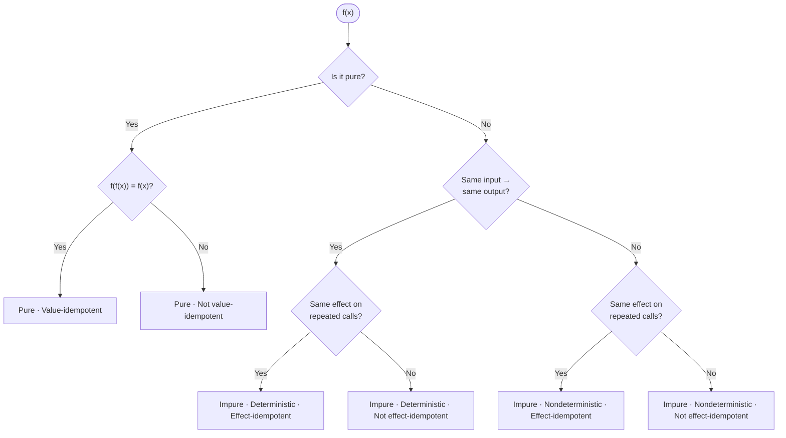

The terms *pure*, *deterministic*, and *idempotent* are not synonyms. Each describes a different property of a function, and confusing them leads to sloppy reasoning about code. This post breaks down all three with concrete Python examples.

<!--more-->

---

## 1. Two Kinds of Idempotency

The word "idempotent" has two distinct formal meanings, and conflating them is the root of many misunderstandings.

**Value-idempotent (mathematical):** `f(f(x)) = f(x)`. Applying the function to its own output gives the same result. For this to be well-defined, the function's input and output types must be exactly the same (an *endomorphism*, `a -> a`). These are *projections* — they collapse their input into a canonical form, and applying them again changes nothing. Examples: `abs`, `upper`, `clamp`. Counter-examples: `negate`, `increment`.

**Effect-idempotent (imperative):** Calling a function multiple times has the same effect on system state as calling it once. This is what matters for retries, APIs, and distributed systems. Examples: HTTP `PUT`, HTTP `DELETE`, upserting a database row.

The unifying intuition: **doing it twice is the same as doing it once** — applied either to *values* or to *effects*.

---

## 2. The Three Properties

**Determinism.** A deterministic function always returns the same output for the same input — across calls, across time, across machines. Nondeterminism creeps in whenever a function consumes a **hidden input** not in the argument list:

- **Hidden state** — a database row, the system clock, an environment variable, a global counter. The value can change between calls, so the output changes too.
- **Pseudo-random number generators (PRNGs)** — deterministic algorithms that become nondeterministic because they are typically seeded by a hidden input.
- **True random number generators (TRNGs)** — hardware or quantum RNGs are nondeterministic *by nature*. There is no hidden input to expose; the output is genuinely unpredictable.
- **Concurrency** — when threads share mutable state, the OS scheduler's timing becomes an implicit input. Two runs of the same code can interleave differently, producing different results.

**Purity.** A pure function has two constraints: (1) its output depends *only* on its input arguments (which implies it is deterministic), and (2) it produces *no side effects* — no writes to disk, no mutations of external state, no network calls. Pure functions are *referentially transparent*, meaning a function call can be replaced with its return value without changing the program's behavior. An impure function violates at least one of those constraints.

**Idempotency.** As defined in Section 1 — either value-idempotent (`f(f(x)) = f(x)`) or effect-idempotent (repeated calls leave state unchanged after the first).

**All pure functions are deterministic. All pure functions are trivially effect-idempotent (no effects to repeat). But pure functions are NOT automatically value-idempotent.**

---

## 3. How They Combine

Purity is the strongest property: it implies determinism and trivial effect-idempotency. But the reverse does not hold. Let's walk through each combination.

### Pure, Value-Idempotent

```python
def normalize_email(email: str) -> str:
    """Strip whitespace and lowercase. f(f(x)) = f(x)."""
    return email.strip().lower()

assert normalize_email("  Alice@Example.COM  ") == "alice@example.com"
assert normalize_email(normalize_email("  Alice@Example.COM  ")) == "alice@example.com"
```

### Pure, NOT Value-Idempotent

```python
from urllib.parse import quote

def url_encode(text: str) -> str:
    """Percent-encode a string for URLs."""
    return quote(text, safe="")

assert url_encode("hello world") == "hello%20world"
assert url_encode(url_encode("hello world")) == "hello%2520world"  # Double-encoded!
```

Double-encoding (`%20` → `%2520`) is a real and common bug — pure, but not value-idempotent.

### Impure, Deterministic, Effect-Idempotent

Like HTTP `PUT` — writing the same value again leaves the system unchanged.

```python
config_store: dict[str, str] = {}

def upsert_config(key: str, value: str) -> str:
    config_store[key] = value
    return f"OK: {key}={value}"

assert upsert_config("timeout", "30") == "OK: timeout=30"
assert upsert_config("timeout", "30") == "OK: timeout=30"

# State after one call or ten calls is identical:
assert config_store == {"timeout": "30"}
```

### Impure, Deterministic, NOT Effect-Idempotent

```python
audit_log: list[str] = []

def append_to_audit_log(event: str) -> str:
    audit_log.append(event)
    return f"logged: {event}"

assert append_to_audit_log("user_login") == "logged: user_login"
assert append_to_audit_log("user_login") == "logged: user_login"

# Same return value, but the side effect accumulated:
assert len(audit_log) == 2  # Not effect-idempotent!
```

Every call adds another entry — a retry produces a duplicate log line.

### Impure, Nondeterministic, Effect-Idempotent

This is the classic case that confuses most developers.

```python
database: dict[str, str] = {"item_1": "Apple", "item_2": "Banana"}

def delete_item(item_id: str) -> int:
    if item_id in database:
        del database[item_id]
        return 200  # OK
    return 404  # Not Found

assert delete_item("item_1") == 200   # First call: deletes the item
assert delete_item("item_1") == 404   # Second call: item already gone

# But the state of the database is the same after both calls!
```

The *return value* changed (200 → 404), but the *state of the system* did not. Effect-idempotency is about the **effect**, not the **output**.

### Impure, Nondeterministic, NOT Effect-Idempotent

```python
_next_id = 0

def create_user(email: str) -> dict:
    global _next_id
    _next_id += 1
    user = {"id": _next_id, "email": email}
    # Imagine: database.insert(user)
    return user

first  = create_user("alice@example.com")  # {"id": 1, ...}
second = create_user("alice@example.com")  # {"id": 2, ...}

assert first["id"] != second["id"]  # Different output (nondeterministic)
# And two rows now exist in the "database" (not effect-idempotent)
```

A network retry creates a duplicate user — this is why payment APIs require idempotency keys:

```python
seen_requests: dict[str, dict] = {}

def create_user_idempotent(email: str, idempotency_key: str) -> dict:
    if idempotency_key in seen_requests:
        return seen_requests[idempotency_key]

    user = {"id": generate_id(), "email": email}
    # database.insert(user)
    seen_requests[idempotency_key] = user
    return user
```

The first call creates the resource and caches the result; subsequent calls with the same key return the cached result and skip the write.

---

## 4. The Decision Tree



---

## 5. Why This Matters

These distinctions have direct, practical consequences:

**Pure functions** are trivially testable (no mocks, no setup) and safely memoizable (`@functools.lru_cache`). Keep functions pure whenever possible.

**Effect-idempotency** is a design requirement for any operation that might be retried — HTTP handlers, message queue consumers, database migrations.

**Value-idempotency** matters for normalization and canonicalization. Value-idempotent functions can safely be applied "just in case" without worrying about double-processing.

**Read-only operations** are impure and nondeterministic, yet effect-idempotent — reading changes nothing. In HTTP/REST this category is called **safe**; safe operations can always be retried without risk.

**Impurity** is not evil, but it should be *contained*. Push side effects to the edges of your system.

---

## Conclusion

Three properties, three questions:

1.  **Is it pure?** Yes → automatically deterministic, trivially effect-idempotent. But check value-idempotency.
2.  **Same input, same output?** Yes → *deterministic*. No → *nondeterministic*.
3.  **Same effect on repeated calls?** Yes → *effect-idempotent*. No → not.
