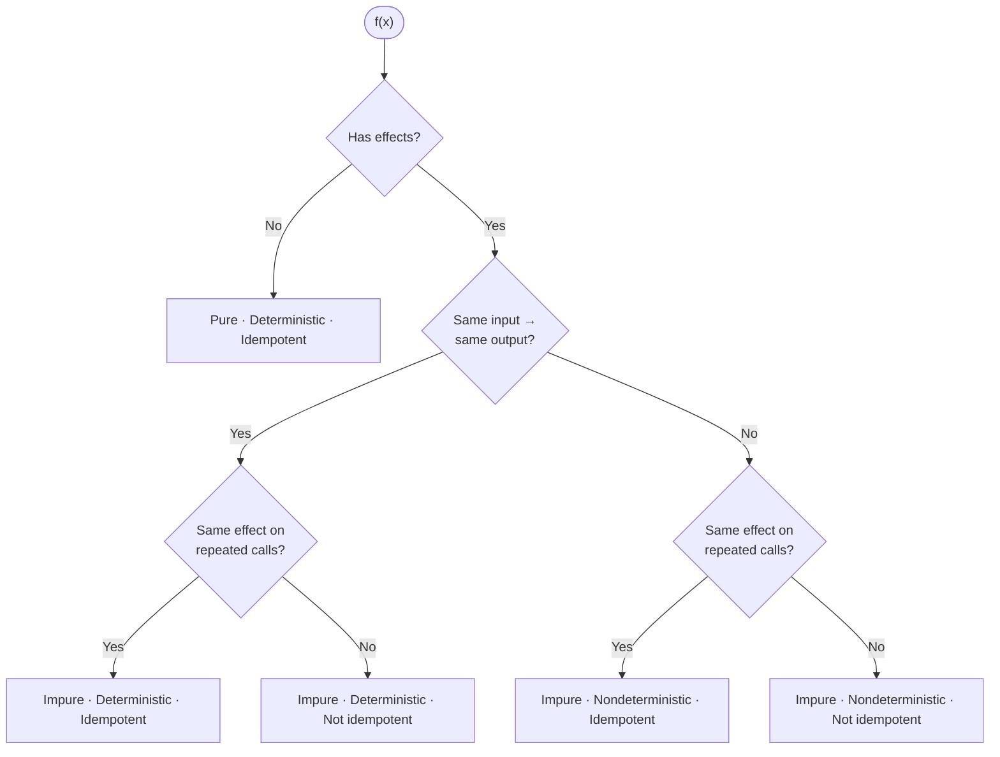

The terms *pure*, *deterministic*, and *idempotent* get thrown around in technical conversations as if they were synonyms. They are not. Each one describes a different property of a function's behavior, and confusing them leads to sloppy reasoning about code. A function can be deterministic but impure. It can be idempotent without being deterministic. And purity, far from being just another property in the list, is actually the strongest of the three — it implies the other two.

This post breaks down these three properties, shows how they relate, and provides concrete Python examples so you can build a clear mental model.

<!--more-->

---

## 1. The Three Properties

Let's start with clean definitions before we mix them together.

### Purity

A **pure function** has two constraints:

1.  Its output depends *only* on its input arguments.
2.  It produces *no side effects* — no writes to disk, no mutations of external state, no network calls.

Purity is about isolation. A pure function is a hermetically sealed box: data goes in, data comes out, and nothing else in the universe changes.

```python
# Pure: output depends only on input, no side effects.
def add(a: int, b: int) -> int:
    return a + b
```

An **impure function** violates at least one of those constraints. It might read hidden state, mutate a global variable, write to a log, or send a network request.

```python
# Impure: mutates external state (the list).
def append_and_count(item: str, log: list[str]) -> int:
    log.append(item)
    return len(log)
```

### Determinism

A **deterministic function** always returns the same output for the same input. The key word is *always* — across calls, across time, across machines.

```python
# Deterministic: "hello" always uppercases to "HELLO".
def shout(text: str) -> str:
    return text.upper()
```

A **nondeterministic function** can produce different outputs even when called with the same arguments, because it depends on some hidden state: the clock, a random seed, a database row, a file on disk.

```python
import random

# Nondeterministic: same input, different output every time.
def roll_dice(sides: int) -> int:
    return random.randint(1, sides)
```

### Idempotency

An **idempotent function** can be called multiple times with the same arguments and, after the first call, nothing changes. The second call has the same effect as the first. The tenth call has the same effect as the first. Formally: there are no *changes of state* between subsequent identical calls.

This is **not** the same as determinism. A function can return different values on repeated calls and still be idempotent, as long as the *state of the world* doesn't keep changing.

```python
import os

# Idempotent: calling it twice doesn't create the directory twice.
def ensure_directory(path: str) -> None:
    os.makedirs(path, exist_ok=True)
```

---

## 2. How They Combine

These three properties are not independent. Purity is the strongest: a pure function is always deterministic (same input, same output) and always idempotent (no state to change between calls). But the reverse is not true — a function can be deterministic without being pure, and idempotent without being either. Let's see each combination in practice.

### Pure (The Gold Standard)

This is the function you want to write whenever possible. Same input, same output, no side effects. Purity automatically gives you determinism and idempotency for free.

```python
def clamp(value: float, lo: float, hi: float) -> float:
    """Constrain a value to a range. Pure."""
    return max(lo, min(hi, value))

# Call it a thousand times, nothing changes anywhere.
assert clamp(15.0, 0.0, 10.0) == 10.0
assert clamp(15.0, 0.0, 10.0) == 10.0
```

### Impure + Deterministic (Predictable Side Effects)

The output is predictable from the input, but the function also does something to the outside world. This is **not** necessarily idempotent — the side effect might accumulate.

```python
def log_and_upper(text: str) -> str:
    """Deterministic output, but impure: writes to stdout."""
    result = text.upper()
    print(f"Converted: {result}")  # Side effect!
    return result

# Same output every time, but each call prints a new line.
assert log_and_upper("hello") == "HELLO"
assert log_and_upper("hello") == "HELLO"
```

Each call produces a new line of output. The return value is deterministic, but the side effect accumulates. This function is *not* idempotent.

### Impure + Nondeterministic (The Wild West)

Once a function is impure, it can also be nondeterministic — its output depends on hidden state like the clock, a random seed, or a database row.

```python
from datetime import datetime

def greeting(name: str) -> str:
    """Impure and nondeterministic: reads hidden state (the clock)."""
    hour = datetime.now().hour  # Hidden input: the clock.
    if hour < 12:
        return f"Good morning, {name}"
    return f"Good afternoon, {name}"

# Same input, but the output depends on when you call it.
```

Reading the clock is a form of impurity — the function's output depends on something other than its explicit arguments. It gets worse when you add *output* side effects on top:

```python
import random

_audit_log: list[str] = []

def generate_token(user_id: str) -> str:
    """Nondeterministic and impure: reads randomness, writes to a log."""
    token = f"{user_id}-{random.randint(1000, 9999)}"
    _audit_log.append(f"Generated token for {user_id}")
    return token
```

Every call produces a different token (nondeterministic) and appends to a global list (side effect). Testing this function requires controlling the random seed *and* inspecting the global state.

---

## 3. Idempotency Is Its Own Thing

The examples above covered purity and determinism. Idempotency cuts across both of them in a way that often surprises people.

### Idempotent but Not Deterministic

This is the classic case that confuses most developers. Consider an HTTP `DELETE` request:

```python
database: dict[str, str] = {"item_1": "Apple", "item_2": "Banana"}

def delete_item(item_id: str) -> int:
    """Idempotent: repeated calls don't change state after the first.
    Not deterministic: return value changes between calls."""
    if item_id in database:
        del database[item_id]
        return 200  # OK
    return 404  # Not Found

# First call: deletes the item, returns 200.
assert delete_item("item_1") == 200

# Second call: item is already gone, returns 404.
assert delete_item("item_1") == 404

# But the state of the database is the same after both calls!
# That's idempotency: no state change after the first invocation.
```

The *return value* changed (200 → 404), but the *state of the system* did not change after the first call. That is what idempotency means. It is about the **effect**, not the **output**.

### Deterministic but Not Idempotent

A function can be perfectly predictable and still not idempotent if its side effects accumulate.

```python
counter: list[int] = []

def record_event(event_id: int) -> int:
    """Deterministic output, but not idempotent: state keeps changing."""
    counter.append(event_id)
    return event_id

# The return value is always the same...
assert record_event(42) == 42
assert record_event(42) == 42

# ...but the state keeps growing:
assert len(counter) == 2  # Not idempotent!
```

---

## 4. The Decision Tree

Three yes-or-no questions classify any function:



| Question | Yes | No |
|----------|-----|-----|
| Has effects? | Impure | Pure |
| Same input, same output? | Deterministic | Nondeterministic |
| Same effect on repeated calls? | Idempotent | Not idempotent |


---

## 5. Why This Matters

These distinctions are not academic. They have direct, practical consequences:

**Pure functions** are trivially testable. No setup, no teardown, no mocks. If your business logic lives in pure functions, you can test it exhaustively with simple assertions.

**Idempotency** is a design requirement for any operation that might be retried — HTTP handlers, message queue consumers, database migrations. If your `create_user` endpoint isn't idempotent, a network retry will create a duplicate user.

**Impurity** is not evil, but it should be *contained*. Push side effects to the edges of your system. Let the core logic be pure, and let thin adapter layers handle the messy, impure, nondeterministic real world.

---

## Conclusion

Three properties, three questions about any function:

1.  **Has effects?** If no, the function is *pure* — and automatically deterministic and idempotent. If yes, it is *impure*, and you need to ask the next two questions.
2.  **Same input, same output?** Yes means *deterministic*, no means *nondeterministic*.
3.  **Same effect on repeated calls?** Yes means *idempotent*, no means *not idempotent*.

Purity is the strongest guarantee — it implies the other two. But once a function is impure, determinism and idempotency become separate concerns you need to reason about explicitly. When you are clear about which properties your function has — and which it lacks — you can make better decisions about where to place it in your architecture, how to test it, and how much you can trust it under retry and concurrency.
